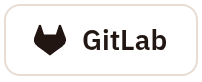
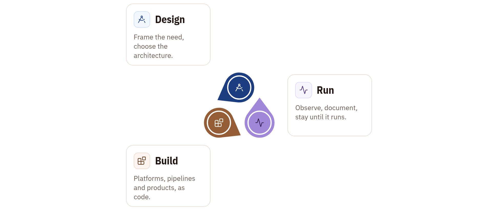
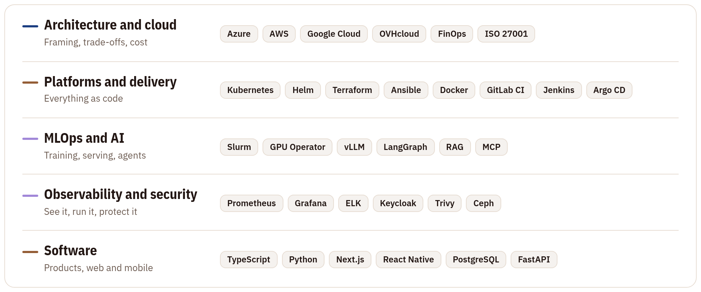
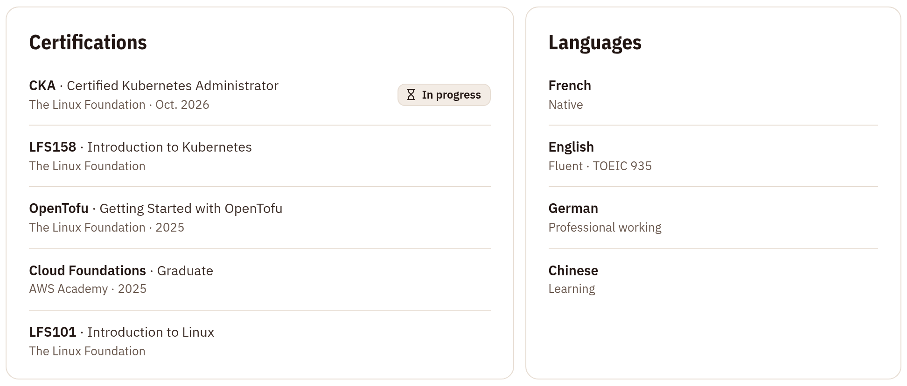
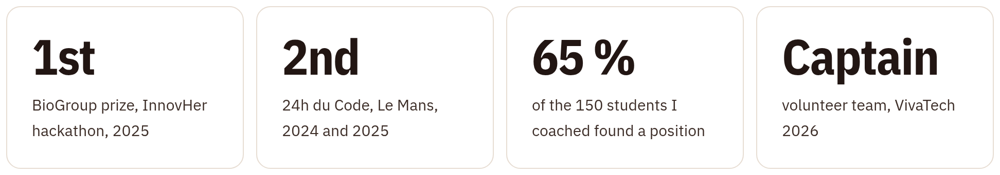

<picture><source media="(max-width: 600px) and (prefers-color-scheme: dark)" srcset="assets/banner-m-dark.png"><source media="(max-width: 600px)" srcset="assets/banner-m-light.png"><source media="(prefers-color-scheme: dark)" srcset="assets/banner-dark.png"></picture>

 

<a href="https://stevenoumi.com"><picture><source media="(prefers-color-scheme: dark)" srcset="assets/badges/website-dark.png"></picture></a>
<a href="https://www.linkedin.com/in/stevenoumi"><picture><source media="(prefers-color-scheme: dark)" srcset="assets/badges/linkedin-dark.png"></picture></a>
<a href="https://gitlab.com/stevenoumi"><picture><source media="(prefers-color-scheme: dark)" srcset="assets/badges/gitlab-dark.png"></picture></a>
<a href="mailto:contact@stevenoumi.com"><picture><source media="(prefers-color-scheme: dark)" srcset="assets/badges/email-dark.png"></picture></a>

 

### Hi, I'm Steve

**I work hand in hand with customers to make AI platforms fit real operations.**

DevOps & MLOps Engineer at GE HealthCare, where I build the platforms that train and serve medical AI models. Before that, I spent two years designing cloud and security architectures for clients at Alfa-Safety, as an apprentice engineer at ESEO. Currently preparing the CKA.

After hours, I ship my own products, coach students on their first job, and organise hackathons where young people build AI for real health problems.

Case studies, products and resume: **[stevenoumi.com](https://stevenoumi.com)**

 

### Case studies

Six systems, each told from the need to the result. The full stories are on [stevenoumi.com/work](https://stevenoumi.com/work/).

<a href="https://stevenoumi.com/work/"><picture><source media="(max-width: 600px) and (prefers-color-scheme: dark)" srcset="assets/sections/cases-m-dark.png"><source media="(max-width: 600px)" srcset="assets/sections/cases-m-light.png"><source media="(prefers-color-scheme: dark)" srcset="assets/sections/cases-dark.png"></picture></a>

 

### How I work

Every project, at work or after hours, follows the same three steps.

<picture><source media="(max-width: 600px) and (prefers-color-scheme: dark)" srcset="assets/sections/method-m-dark.png"><source media="(max-width: 600px)" srcset="assets/sections/method-m-light.png"><source media="(prefers-color-scheme: dark)" srcset="assets/sections/method-dark.png"></picture>

 

### Products I build

Software I design and ship after hours, from the mobile app to the cluster behind it. More on [stevenoumi.com/products](https://stevenoumi.com/products/).

<a href="https://stevenoumi.com/products/"><picture><source media="(max-width: 600px) and (prefers-color-scheme: dark)" srcset="assets/sections/products-m-dark.png"><source media="(max-width: 600px)" srcset="assets/sections/products-m-light.png"><source media="(prefers-color-scheme: dark)" srcset="assets/sections/products-dark.png"></picture></a>

 

### Skills

<picture><source media="(max-width: 600px) and (prefers-color-scheme: dark)" srcset="assets/sections/skills-m-dark.png"><source media="(max-width: 600px)" srcset="assets/sections/skills-m-light.png"><source media="(prefers-color-scheme: dark)" srcset="assets/sections/skills-dark.png"></picture>

 

### Certifications and languages

<picture><source media="(max-width: 600px) and (prefers-color-scheme: dark)" srcset="assets/sections/credentials-m-dark.png"><source media="(max-width: 600px)" srcset="assets/sections/credentials-m-light.png"><source media="(prefers-color-scheme: dark)" srcset="assets/sections/credentials-dark.png"></picture>

 

### Beyond code

<picture><source media="(max-width: 600px) and (prefers-color-scheme: dark)" srcset="assets/sections/impact-m-dark.png"><source media="(max-width: 600px)" srcset="assets/sections/impact-m-light.png"><source media="(prefers-color-scheme: dark)" srcset="assets/sections/impact-dark.png"></picture>

 

### Let's connect

Most of my day-to-day work lives on GitLab, in company and product repositories. This GitHub is my public showcase. 
Open to conversations about AI, cloud, innovation and entrepreneurship.

<a href="https://stevenoumi.com"><picture><source media="(prefers-color-scheme: dark)" srcset="assets/badges/website-dark.png"></picture></a>
<a href="https://www.linkedin.com/in/stevenoumi"><picture><source media="(prefers-color-scheme: dark)" srcset="assets/badges/linkedin-dark.png"></picture></a>
<a href="https://gitlab.com/stevenoumi"><picture><source media="(prefers-color-scheme: dark)" srcset="assets/badges/gitlab-dark.png"></picture></a>
<a href="mailto:contact@stevenoumi.com"><picture><source media="(prefers-color-scheme: dark)" srcset="assets/badges/email-dark.png"></picture></a>

