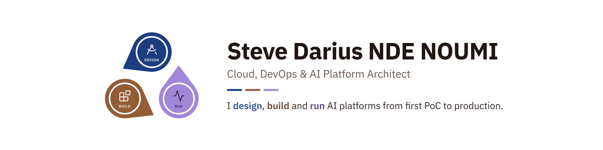
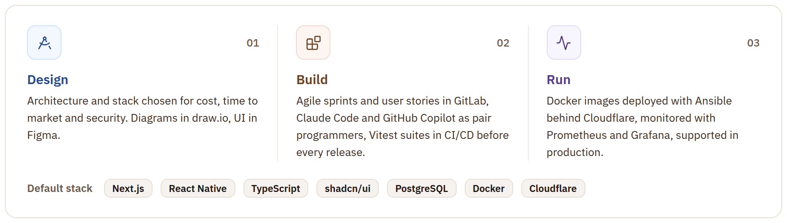
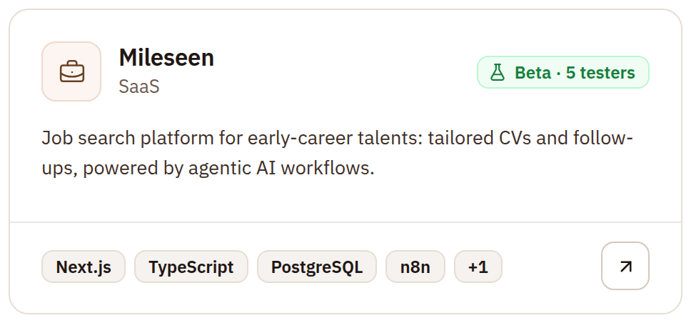
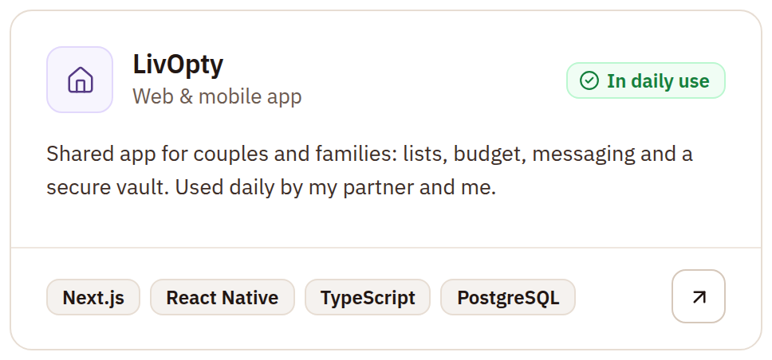
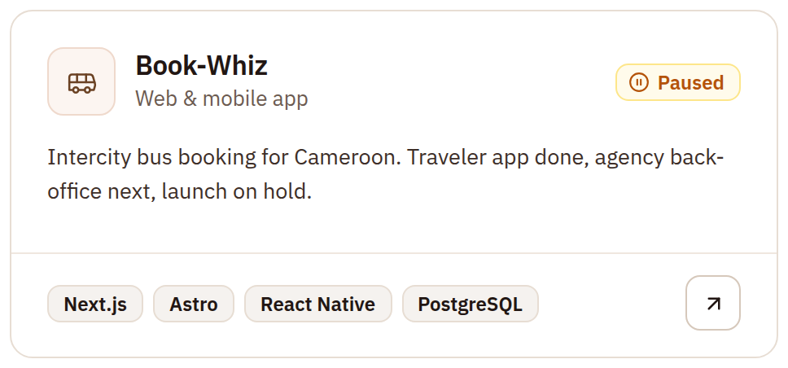
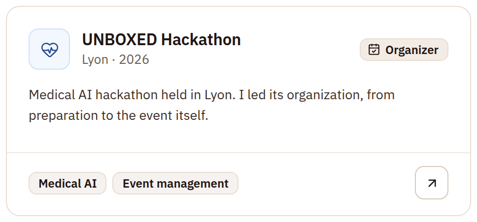
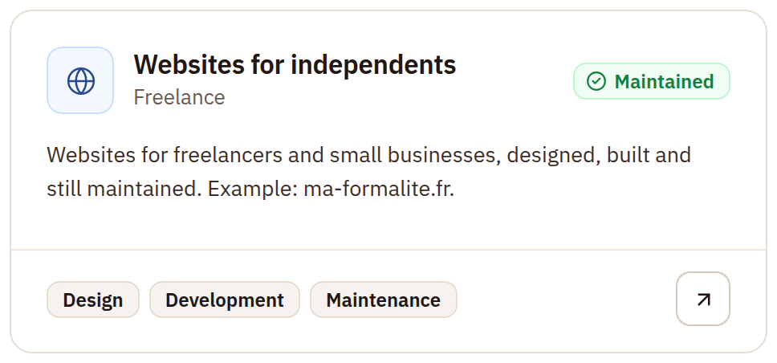
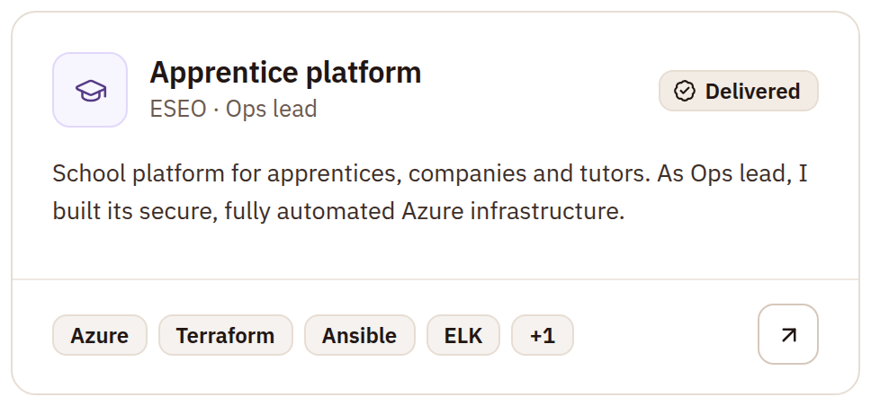

<picture>
  <source media="(max-width: 600px) and (prefers-color-scheme: dark)" srcset="assets/banner-m-dark.png">
  <source media="(max-width: 600px)" srcset="assets/banner-m-light.png">
  <source media="(prefers-color-scheme: dark)" srcset="assets/banner-dark.png">
  
</picture>

<a href="https://www.linkedin.com/in/stevenoumi"><picture><source media="(max-width: 600px)" srcset="assets/badges/linkedin-m.png"></picture></a>
<a href="https://gitlab.com/stevenoumi"><picture><source media="(max-width: 600px)" srcset="assets/badges/gitlab-m.png"></picture></a>
<a href="mailto:contact@stevenoumi.com"><picture><source media="(max-width: 600px)" srcset="assets/badges/email-m.png"></picture></a>

### Hi, I'm Steve

**I work hand in hand with customers to make AI platforms fit real operations.**

DevOps & MLOps Engineer at GE HealthCare. I build scalable, secure and automated infrastructure that powers AI for medical imaging and diagnostics, in a regulated environment. My goal: turning machine learning research into real impact for patients. Currently preparing the CKA.

Entrepreneur at heart, I design SaaS and mobile apps for everyday problems off hours, from the first idea to launch. Basketball, medicine and volunteering keep me grounded.

 

### What I've built

<picture><source media="(max-width: 600px) and (prefers-color-scheme: dark)" srcset="assets/sections/built-m-dark.png"><source media="(max-width: 600px)" srcset="assets/sections/built-m-light.png"><source media="(prefers-color-scheme: dark)" srcset="assets/sections/built-dark.png"></picture>

 

### Selected projects

I run my side projects like products, with the same three steps as at work: design, build, run.

<picture><source media="(max-width: 600px) and (prefers-color-scheme: dark)" srcset="assets/sections/process-m-dark.png"><source media="(max-width: 600px)" srcset="assets/sections/process-m-light.png"><source media="(prefers-color-scheme: dark)" srcset="assets/sections/process-dark.png"></picture>

<a href="https://gitlab.com/stevenoumi"><picture><source media="(max-width: 600px) and (prefers-color-scheme: dark)" srcset="assets/projects/mileseen-m-dark.png"><source media="(max-width: 600px)" srcset="assets/projects/mileseen-m-light.png"><source media="(prefers-color-scheme: dark)" srcset="assets/projects/mileseen-dark.png"></picture></a>
<a href="https://gitlab.com/stevenoumi"><picture><source media="(max-width: 600px) and (prefers-color-scheme: dark)" srcset="assets/projects/livopty-m-dark.png"><source media="(max-width: 600px)" srcset="assets/projects/livopty-m-light.png"><source media="(prefers-color-scheme: dark)" srcset="assets/projects/livopty-dark.png"></picture></a>

<a href="https://gitlab.com/stevenoumi"><picture><source media="(max-width: 600px) and (prefers-color-scheme: dark)" srcset="assets/projects/bookwhiz-m-dark.png"><source media="(max-width: 600px)" srcset="assets/projects/bookwhiz-m-light.png"><source media="(prefers-color-scheme: dark)" srcset="assets/projects/bookwhiz-dark.png"></picture></a>
<a href="https://gitlab.com/stevenoumi"><picture><source media="(max-width: 600px) and (prefers-color-scheme: dark)" srcset="assets/projects/unboxed-m-dark.png"><source media="(max-width: 600px)" srcset="assets/projects/unboxed-m-light.png"><source media="(prefers-color-scheme: dark)" srcset="assets/projects/unboxed-dark.png"></picture></a>

<a href="https://ma-formalite.fr"><picture><source media="(max-width: 600px) and (prefers-color-scheme: dark)" srcset="assets/projects/websites-m-dark.png"><source media="(max-width: 600px)" srcset="assets/projects/websites-m-light.png"><source media="(prefers-color-scheme: dark)" srcset="assets/projects/websites-dark.png"></picture></a>
<a href="https://gitlab.com/stevenoumi"><picture><source media="(max-width: 600px) and (prefers-color-scheme: dark)" srcset="assets/projects/eseo-m-dark.png"><source media="(max-width: 600px)" srcset="assets/projects/eseo-m-light.png"><source media="(prefers-color-scheme: dark)" srcset="assets/projects/eseo-dark.png"></picture></a>

 

### Tech stack

<picture><source media="(max-width: 600px) and (prefers-color-scheme: dark)" srcset="assets/stack/stack-m-dark.png"><source media="(max-width: 600px)" srcset="assets/stack/stack-m-light.png"><source media="(prefers-color-scheme: dark)" srcset="assets/stack/stack-dark.png"></picture>

 

### Hackathons & community

<picture><source media="(max-width: 600px) and (prefers-color-scheme: dark)" srcset="assets/awards/awards-m-dark.png"><source media="(max-width: 600px)" srcset="assets/awards/awards-m-light.png"><source media="(prefers-color-scheme: dark)" srcset="assets/awards/awards-dark.png"></picture>

 

### Let's connect

Most of my day-to-day work lives on GitLab, in company and product repositories. This GitHub is my public showcase. 
Open to conversations about AI, cloud, innovation and entrepreneurship.

<a href="https://www.linkedin.com/in/stevenoumi"><picture><source media="(max-width: 600px)" srcset="assets/badges/linkedin-m.png"></picture></a>
<a href="https://gitlab.com/stevenoumi"><picture><source media="(max-width: 600px)" srcset="assets/badges/gitlab-m.png"></picture></a>
<a href="mailto:contact@stevenoumi.com"><picture><source media="(max-width: 600px)" srcset="assets/badges/email-m.png"></picture></a>

